<div align="center">

# 📜 Lore

### Your product's context layer for AI coding agents.

**One source of truth. Every Claude. Full context.**

Write your product knowledge once. Every developer's Claude on your team gets it automatically.

[](LICENSE)
[](https://modelcontextprotocol.io)
[](CONTRIBUTING.md)
[](https://github.com/teamlore/lore)

<br />

[Quick Start](#-quick-start) · [How It Works](#-how-it-works) · [For PMs](#-why-pms-love-lore) · [Roadmap](#-roadmap) · [Contributing](#-contributing)

<br />

---

<br />



<br />
<br />

</div>

## 💥 The Problem

You're a PM at a fast-moving startup. Your team runs Claude Code every day. But every session starts from scratch.

**Your developers' Claudes don't know:**
- 🚫 What your product actually does
- 🚫 Why you made that architecture decision last month
- 🚫 What customers are complaining about
- 🚫 What the priorities are this quarter
- 🚫 What conventions your team follows

You've got PRDs in Notion. Strategy docs in Google Drive. Decisions in Slack threads. Customer feedback in Linear. And a CLAUDE.md file in each repo that's three months stale.

**The result?** Every Claude session is a coin flip. Sometimes it nails it. Sometimes it builds the exact opposite of what you wanted - because it didn't have the context.

<br />

## ✨ The Solution

**Lore** is a shared context layer for your team's AI agents.

You write your product knowledge once. Lore makes sure every developer's Claude has it - automatically, always up to date, searchable.

```
┌──────────────────────────────────────────────────────┐
│                                                      │
│   📝  PM writes product context                      │
│       PRDs, decisions, strategy, conventions          │
│                                                      │
│                      ║                               │
│                      ▼                               │
│              ┌──────────────┐                        │
│              │  📜  Lore    │  ◄── Git repo          │
│              │              │      Version-controlled │
│              │  base.md     │      Your source of     │
│              │  docs/       │      truth              │
│              │  lore.yaml   │                         │
│              └──────┬───────┘                        │
│                     │                                │
│          ┌──────────┼──────────┐                     │
│          ▼          ▼          ▼                     │
│     🟢 Dev A   🟢 Dev B   🟢 Dev C                  │
│     Claude     Claude     Claude                     │
│     + lore     + lore     + lore                     │
│                                                      │
│   Every Claude session has full product context.     │
│                                                      │
└──────────────────────────────────────────────────────┘
```

<br />

## 🚀 Quick Start

### For PMs - Create the Lore

Don't overthink it. Open Claude and say: *"Help me write a base.md for Lore - here's what our product does and what matters right now."* Or just copy the snippet below and fill it in.

```bash
# Initialize a new lore in your GitHub org
npx @teamlore/cli init my-company-lore

# This creates a repo with:
#   base.md      → Core product context (always injected)
#   docs/        → Searchable knowledge base
#   lore.yaml    → Configuration
```

Write your product knowledge in `base.md` - the DNA that every Claude should know:

```markdown
# Acme Product Context

## What We Do
Acme is a deployment platform for infrastructure-as-code.
We serve DevOps teams at mid-market companies (200-2000 employees).

## Current Priorities (Q1 2026)
1. Self-service onboarding - reduce time-to-first-deploy to under 10 min
2. Cost visibility dashboard - customers' #1 feature request
3. SOC 2 Type II compliance - blocker for 4 enterprise deals

## Key Decisions
- We use event sourcing for the audit log. Do not refactor to CRUD.
- All API responses follow our envelope format: { data, meta, errors }
- Customer-facing copy follows TONE.md - no corporate fluff.

## Architecture
- Monorepo: apps/web (React), apps/api (Node), packages/shared
- Postgres primary, Redis for caching and queues
- All infrastructure managed through Terraform
```

Add deeper docs to the `docs/` folder - PRDs, strategy docs, customer research, architecture decisions. These become searchable.

```bash
# Add a PRD to the lore
lore add docs/prd-cost-dashboard.md

# Or just copy your existing markdown files
cp ~/product-docs/*.md docs/

# Push to your org
git push origin main
```

### For Developers - Connect in One Command

```bash
# Connect your Claude to the team's lore
npx @teamlore/cli connect https://github.com/acme/lore
```

That's it. This:

1. 📦 Clones the lore repo locally
2. 🔍 Builds a search index of all docs
3. ⚙️ Adds Lore as an MCP server to your Claude Code config
4. ✅ Every Claude session now has full product context

<br />

## 🔍 How It Works

### Always-On Base Context

Every time a developer starts Claude Code, the lore's `base.md` is automatically injected into the conversation. No action needed. Claude just *knows* your product.

### Search the Lore

For deeper context, Claude can search the lore's knowledge base:

```
Developer: "Refactor the billing module to support annual plans"

Claude: Let me check the lore for billing context...
         [calls search_lore("billing annual plans pricing model")]

Claude: Based on your team's PRD for the pricing overhaul,
        annual plans should offer a 20% discount and use
        the same billing engine with a yearly interval flag.
        I see a note from your PM that we should NOT create
        a separate billing path - keep it unified. Let me
        implement that...
```

Claude automatically searches the lore when it needs context. Developers can also ask explicitly:

```
Developer: "What does the lore say about our auth architecture?"
```

### Stays Fresh

The local MCP server pulls from Git periodically. When the PM pushes updates, every developer's lore syncs automatically.

```bash
# PM pushes a new decision
lore add docs/decision-switch-to-postgres-16.md
git push

# Every dev's lore picks it up on next sync (configurable, default: on session start)
```

<br />

## 💜 Why PMs Love Lore

| Without Lore | With Lore |
|---|---|
| Write a PRD, hope devs read it | Write it once, every Claude reads it |
| Repeat the same context in every code review | Claude already knows the "why" behind decisions |
| Devs build features that miss the point | Claude has the full product picture |
| CLAUDE.md files go stale in a week | Single source of truth, always synced |
| No idea what context Claude is using | `lore status` shows what's connected |

### Lore gives PMs a superpower they never had before: **direct influence over every AI-assisted line of code.**

Your product knowledge doesn't live in a doc nobody reads. It lives inside the tool your developers use every single day.

<br />

## 📂 Lore Repo Structure

```
lore/
├── base.md              # 🧬 Core product DNA (always injected)
├── lore.yaml            # ⚙️ Configuration
├── docs/                # 📚 Searchable knowledge base
│   ├── prds/           # Product requirement docs
│   ├── decisions/      # Architecture & product decisions
│   ├── research/       # Customer research & feedback
│   └── guides/         # Conventions, patterns, standards
└── .github/
    └── CODEOWNERS       # PM controls the lore
```

**`lore.yaml`** - configure how Lore works:

```yaml
version: 1
name: "Acme Lore"

base:
  file: base.md
  max_tokens: 4000           # Keep base context focused

sync:
  strategy: on_session_start  # or: periodic (5m, 15m, 1h)

search:
  engine: local               # local TF-IDF for v1
  include:
    - "docs/**/*.md"
  exclude:
    - "docs/archive/**"

access:
  write: ["pm-team"]          # Only PMs update the lore
  read: ["engineering"]       # All engineers can connect
```

<br />

## 🛠️ CLI Reference

### PM Commands

```bash
lore init <name>                     # Create a new lore repo
lore add <file>                      # Add a doc to the lore
lore update <file>                   # Update an existing doc
lore status                          # Show lore health & connected devs
lore search <query>                  # Test search from your terminal
```

### Developer Commands

```bash
lore connect <repo-url>              # Connect Claude to a team's lore
lore disconnect                      # Remove lore from Claude config
lore sync                            # Force-pull latest from lore
lore status                          # Show connection status & last sync
```

<br />

## 🗺️ Roadmap

### ✅ v0.1 - Foundation
- [x] Lore repo structure & conventions
- [x] MCP server for Claude Code
- [x] `base.md` auto-injection
- [x] `search_lore` tool with local indexing
- [x] `lore connect` one-command setup
- [x] Git-based sync

### 🔨 v0.2 - Smarter Lore
- [ ] Notion connector - index your Notion workspace
- [ ] Linear connector - pull project context & active tickets
- [ ] Auto-summarization - Lore generates `base.md` from your docs
- [ ] Freshness alerts - flag stale docs that need PM review

### 🔮 v0.3 - Team Intelligence
- [ ] Context analytics - see what knowledge Claude uses most
- [ ] Gap detection - Lore identifies missing context from dev questions
- [ ] Multi-lore support - connect to team lore + company lore
- [ ] Slack connector - capture decisions from threads

### 🏢 v1.0 - Enterprise Ready
- [ ] RBAC - fine-grained access control per doc/folder
- [ ] SSO/SCIM integration
- [ ] Audit logs - who read what, when
- [ ] On-prem deployment
- [ ] Multi-agent support (Cursor, Copilot, Windsurf)

<br />

## 🤔 FAQ

**Is this just a fancy CLAUDE.md?**

CLAUDE.md is per-repo and manually maintained. Lore is org-wide, centrally managed by the PM, searchable, and auto-synced. Think of it as the difference between a sticky note on your monitor and a team wiki.

**Does this work with agents other than Claude?**

v0.1 supports Claude Code via MCP. v1.0 will support any agent that speaks MCP, plus native integrations for Cursor, Copilot, and Windsurf.

**What if I already have a CLAUDE.md in my repos?**

They work together. Your repo's CLAUDE.md has repo-specific instructions (build commands, test conventions). Lore has org-wide product context. Claude gets both.

**How is this different from Mem0 / Zep / Letta?**

Those are agent memory SDKs - they give individual agents persistent memory across sessions. Lore is a PM-controlled knowledge layer that ensures every agent on the team has the same product context. Memory is what an agent *remembers*. Lore is what an agent *should know*.

**Is the lore content sent to Anthropic/OpenAI?**

Same as any Claude Code session - the content goes to the model provider for inference. Lore doesn't store or transmit data anywhere else. Everything runs locally on the dev's machine.

<br />

## 💪 Contributing

Lore is open source and we'd love your help.

```bash
git clone https://github.com/teamlore/lore
cd lore
npm install
npm run dev
```

Check out the [Contributing Guide](CONTRIBUTING.md) for details on:
- Setting up the development environment
- Architecture & code conventions
- Submitting pull requests

**First time contributing?** Look for issues labeled [`good first issue`](https://github.com/teamlore/lore/issues?q=label%3A%22good+first+issue%22).

<br />

## 📄 License

MIT - use it, fork it, make it yours.

<br />

---

<div align="center">

**Built for PMs who are tired of saying "but I wrote a PRD for that."**

📜

[Get Started](#-quick-start) · [Star on GitHub](https://github.com/teamlore/lore) · [Report an Issue](https://github.com/teamlore/lore/issues)

</div>
